# GSMG.IO 5 BTC puzzle hints

This repository contains all publicly known hints for GSMG.IO 5 BTC puzzle challenge. Contributions are welcome!

If you find this useful, please donate BTC at [bc1qla7lmz3guzz3cezhfl72r0w546a4gyacpu530r](https://www.blockchain.com/btc/address/bc1qla7lmz3guzz3cezhfl72r0w546a4gyacpu530r)


- [Summary](#summary)
- [Tools](#tools)
- Walkthrough
  1. [Phase 0](#phase-0---the-bunny-image) | [Notebook](./phase0.ipynb)
  2. [Phase 1](#phase-1---the-warning) | [Notebook](./phase1.ipynb)
  3. [Phase 2](#phase-2---mr-robot) | [Notebook](./phase2.ipynb)
     * [Phase 2.1](#phase-21)
     * [Phase 2.2](#phase-22)
  4. [Phase 3](#phase-3---free-will) | [Notebook](./phase3.ipynb)
  5. [Phase 3.2](#phase-32) | [Notebook](./phase3.2.ipynb)
  6. [Decentraland and the path to SalPhaseIon](#salphaseion) | [Notebook](./decentraland.ipynb)
  7. [SalPhaseIon](#salphaseion) | [Notebook](./salphaseion.ipynb)
  8. [Cosmic Duality](#cosmic-duality)
- [Further Hints and 2020-present Timeline](#further-hints-and-2020-present-timeline)
  1. [2020-01-14](#2020-01-14-hint): Official Hint - Roses are Red Poem
  2. [2020-02-20](#2020-02-20-hint): Official Hint - Decentraland
  3. [2020-04-08](#2020-04-08)
  4. [2020-05-11](#2020-05-11): Bitcoin Halving
  5. [2020-06-07](#2020-06-07): First SalPhaseIon mention
  6. [2020-08-02](#2020-08-02): First mention of another door
  7. [2021-01-21](#2021-01-21)
  8. [2021-02-12](#2021-02-12)
  9. [2021-03-01](#2021-03-01): Spelling and primes
  10. [2021-03-14](#2021-03-14): Salph is the last phase
  11. [2021-04-01](#2021-04-01): April Fools
  12. [2021-05-06](#2021-05-06): Instructions for entry into SalPhaseIon
  13. [2021-12-02](#2021-12-02-hint): Official Hint about another door
  14. [2021-12-26](#2021-12-26-christmas-hint): Official Hint
  15. [2022-12-10](#2022-12-10): Book cover about Cosmic Duality
  16. [2023-01-09](#2023-01-09)
  17. [2023-01-12](#2023-01-12---hint): Semi-Official Hint - prime number is a hint
  18. [2023-02-23](#2023-02-23---official-hint): Official Hint - Reverse binary string
  19. [2023-08-03](#2023-08-03-hint): Official Hint - Are you really looking for the btc...?
  20. [2023-08-06](#2023-08-06-hint): Official Hint - The puzzle speaks for me


# Summary
- The puzzle was published at https://gsmg.io/puzzle
- The prize address with 5 BTC is [1GSMG1JC9wtdSwfwApgj2xcmJPAwx7prBe](https://www.blockchain.com/btc/address/1GSMG1JC9wtdSwfwApgj2xcmJPAwx7prBe)
(The creator of the puzzle intended to halve the prize each time Bitcoin halving occurs. It happened for the first time on May 11, 2020, the current value is 2.5 BTC)
- Discussions on Reddit: [gsmgio_5_btc_puzzle](https://www.reddit.com/r/bitcoinpuzzles/comments/dfwcqk/gsmgio_5_btc_puzzle/), [gsmgio_5_btc_puzzle_challenge](https://www.reddit.com/r/bitcoinpuzzles/comments/bf7siz/gsmgio_5_btc_puzzle_challenge/)
- Telegram channel: [invite link](https://t.me/joinchat/AJXEwEWK9gvhxwkgeXJUVw)

# Tools
- SHA256 online tool - https://xorbin.com/tools/sha256-hash-calculator
- To decypher AES encrypted text, use https://www.openssl.org/
- Online cipher tools: https://www.dcode.fr/en
- Various manipulations of text and data: https://gchq.github.io/CyberChef/
```
Useful OpenSSL flags:
-d decrypts data
-a tells OpenSSL that the encrypted data is in base64
-in <filename> specifies the file to decrypt
-out <filename> specifies the file to put the decrypted data in
```

# Walkthrough

## Phase 0 - The Bunny Image

[Link to notebook](./phase0.ipynb)

* "Follow the white rabbit"
* white/yellow square = 0, black/blue square = 1
* Unwrap the squares counter-clockwise
* 8 squares per byte, ascii
* result is "gsmg.io/theseedisplanted"

## Phase 1 - The Warning

[Link to notebook](./phase1.ipynb)

* Post a password on a hidden form to "https://gsmg.io/phase1verification"
* The URL and pictures form lyrics from the song "The Warning" by _Logic_
* The line following "Phase two" is "The flower blossoms through what seems to be a concrete surface"
* password is the line all lowercase, no spaces "theflowerblossomsthroughwhatseemstobeaconcretesurface"
* We are redirected to [http://gsmg.io/choiceisanillusioncreatedbetweenthosewithpowerandthosewithoutaveryspecialdessertiwroteitmyself](http://gsmg.io/choiceisanillusioncreatedbetweenthosewithpowerandthosewithoutaveryspecialdessertiwroteitmyself)

## Phase 2 - Mr Robot

[Link to notebook](./phase2.ipynb)

### Phase 2.1

* Using the url and the text we get matrix quotes, which leads to "causality" as the password for the AES, and is part 1.
* Decoded AES has Mr. Robot references 
* Parts 2,3,4 words can be found to be "Safenet", "Luna", "HSM"

### Phase 2.2

* Brute force is used to find part 5 being "11110", the real path/reasoning hasn't been discovered or disclosed.
* Part 6 is a reference to the Genesis Block of bitcoin, and directly to a particular line in the source code leading to "0x736B6E616220726F662074756F6C69616220646E6F63657320666F206B6E697262206E6F20726F6C6C65636E61684320393030322F6E614A2F33302073656D695420656854" as part 6
* Part 7 is a chess puzzle where a white piece must be moved without causing check-mate. The final solution is "B5KR/1r5B/2R5/2b1p1p1/2P1k1P1/1p2P2p/1P2P2P/3N1N2 b - - 0 1"
* Putting everything together with the case hints and white space hints we get the final password as "causalitySafenetLunaHSM111100x736B6E616220726F662074756F6C69616220646E6F63657320666F206B6E697262206E6F20726F6C6C65636E61684320393030322F6E614A2F33302073656D695420656854B5KR"
* sha256 of that password is the key to decrypting phase 3


## Phase 3 - Free Will

[Link to notebook](./phase3.ipynb)

* First riddle refers to The Venus Project and the "thinker" is "Jacque Fresco"
* Second riddle refers to Alice in Wonderland, the answer to the quote is "just one second", password 2 is "giveitjustonesecond"
* Third riddle refers to the "Heisenberg Uncertainty Principle"
* Using the case and space hints we end up with "jacquefrescogiveitjustonesecondheisenbergsuncertaintyprinciple" as a final password

## Phase 3.2 

[Link to notebook](./phase3.2.ipynb)

* First blob is raw bytes that needs to be decoded with IBM EBCDIC 1141
* The resulting string is enciphered with a beaufort cipher (hinted at with "a beautiful strategic position")
* The key for the cipher is hinted at with "why am I here", a quote from the matrix, the next line being the key "thematrixhasyou".
* This reveals a long block of text that is yet to be solved
* The numbers are enciphered with a VIC Cipher. The numbers are hinted at earlier with "one for one, four for one", use number 1 and 4.
* The alphabet is given below the numbers "fubcd oracle thingky mvps" which must be modified to remove the second "c" and replaced with either "." or "/", after which, the missing alphabet can be added to give "fubcdora/lethingkymvpszjqwx."
* The resulting output has yet to be solved

## Decentraland

[Link to notebook](./decentraland.ipynb)

The decentraland hint along with the [2020 hint](#2020-01-14-hint) were the path leading to [SalPhaseIon](#salphaseion)

To solve decentraland hint:
* Go to decentraland location given in image
* Click the box, a sound will play
* Download the sound
* Open in an audio manipulation program
* Split left and right tracks
* Inverse one of the tracks
* Mix both tracks back together to reveal the hint "HASHTHETEXT"

## SalPhaseIon

[Link to notebook](./salphaseion.ipynb)

* split the string into part based upon like encoded strings
* decode the abba string using a=0, b=1, convert binary to ascii string to give "matrixsumlist"
* Split the next few sections using "z" as a separator
* the "agda" and "cfob" string are encoded the same way
    * o=0,a=1,b=2..., hex string -> ascii
    1. agda = lastwordsbeforearchichoice
    2. cfob = thispassword
* the remaining abba string is "enter"
* everything else hasn't been solved

## Cosmic Duality

This stage is currently unsolved.

# Further Hints and 2020-present Timeline

At the end of 2019, and early 2020, no one had publicly made progress passed the AES blob in phase 3.2. The following are either official hints, or various quotes that _might_ be hints.

## 2020-01-14 Hint

The creator gave a hint on the Telegram group on 2020-01-14:

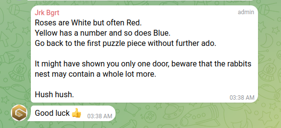

```
Roses are White but often Red.
Yellow has a number and so does Blue.
Go back to the first puzzle piece without further ado.

It might have shown you only one door, beware that the rabbits nest may contain a whole lot more.

Hush hush.
```

Unfortunately, no one publicly managed to decode it

## 2020-02-20 Hint

The creator gave a second hint: a screenshot from within [decentraland](https://decentraland.org/) at -41,-17 

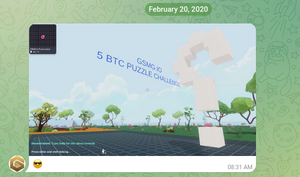

See how it's solved [here](./decentraland.ipynb)

## 2020-04-08

Not an official hint, and could be Jrk trolling

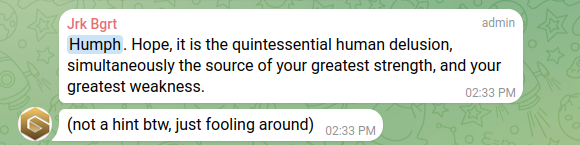

> Humph. Hope, it is the quintessential human delusion, simultaneously the source of your greatest strength, and your greatest weakness.

## 2020-05-11

Bitcoin halving. Half of the prize was moved to [17ucy1K9ZUAaoY6JVtM932W9jUp5LXfyHa](https://www.blockchain.com/explorer/addresses/BTC/17ucy1K9ZUAaoY6JVtM932W9jUp5LXfyHa)

And Jrk mentions a second door.

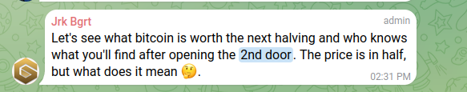

## 2020-06-07

The first public mention of SalPhaseIon (in the `#Crypto_Puzzles` discord channel)

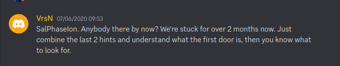

## 2020-08-02

Another mention of the extra door

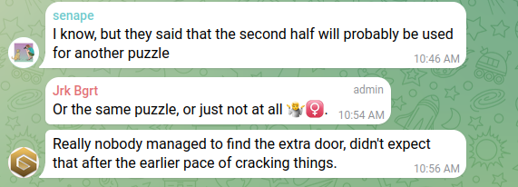

## 2021-01-21

Jrk hinting that people have reached the final stage. It can be seen from the Telegram chat, and discord chat - in retrospect - that some groups may have reached the final stage in late 2020, but did not publicly declare it. This is the first time it was confirmed someone had reached it.

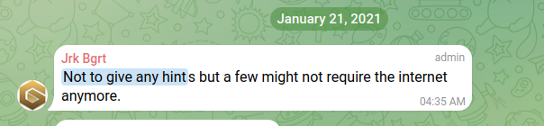

## 2021-02-12

The first mention of SalPhaseIon in Telegram

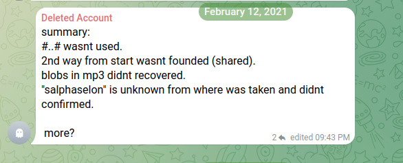


## 2021-03-01

We get confirmation that spelling errors are not significant.

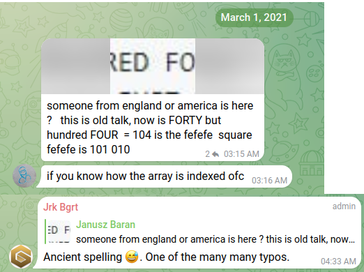

And we find out that there is a "prime part"

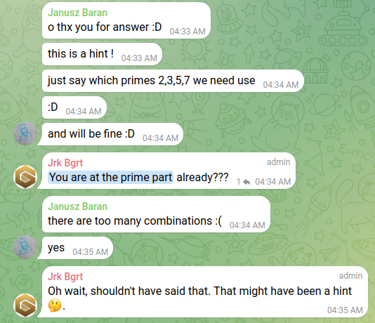

## 2021-03-14

More confirmation of salphaseion being the last phase.

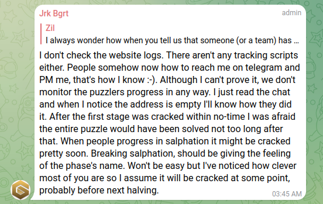

## 2021-04-01

An April Fools Hint. This might not be a real hint


## 2021-04-16

The contents of SalphaseIon leak to telegram

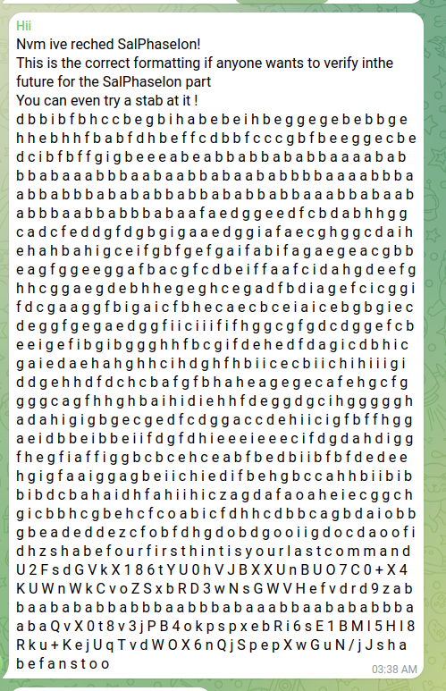

## 2021-05-06

The instructions for salph are finally revealed "hash the text on the image"


### Discussion
It is revealed that the way to get to salphaseion is by taking all the text on the initial image - including the bitcoin address - and then taking a hash of hte result will give you the url needed to enter salphaseion.
```python
>>> import hashlib
>>> h = hashlib.sha256()
>>> h.update('GSMGIO5BTCPUZZLECHALLENGE1GSMG1JC9wtdSwfwApgj2xcmJPAwx7prBe'.encode())
>>> h.hexdigest()
'89727c598b9cd1cf8873f27cb7057f050645ddb6a7a157a110239ac0152f6a32'
```

And so [https://gsmg.io/89727c598b9cd1cf8873f27cb7057f050645ddb6a7a157a110239ac0152f6a32](https://gsmg.io/89727c598b9cd1cf8873f27cb7057f050645ddb6a7a157a110239ac0152f6a32) is the link to SalPhaseIon

See how to [solve it here](./salphaseion.ipynb)

## 2021-12-02 Hint

Another Official hint


## 2021-12-26 Christmas Hint

Another Official Hint

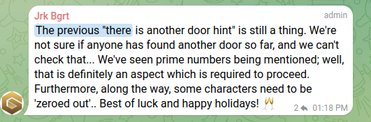

## 2022-12-10

Picture of a book called Cosmic Duality


Book cover:

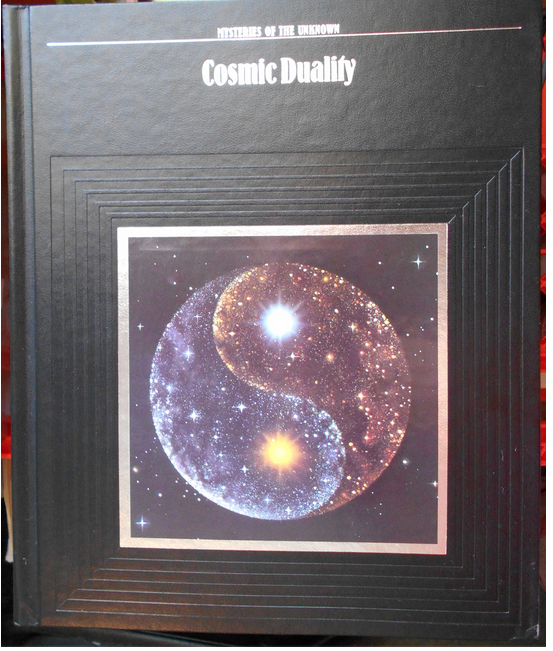

## 2023-01-09

Confirmation that prime number is important 

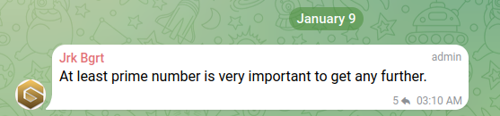

## 2023-01-12 - Hint

The theory of everything is a hint


## 2023-02-23 - Official Hint

A seemingly binary string was posted as a hint, It's decoded to 
```
yellow blue primes matrix sumlist last words before archichoice yinyang 
we wont give away thepassword its in front of  your eyes but youre 
not seeing it very last step is a true give away promised
```

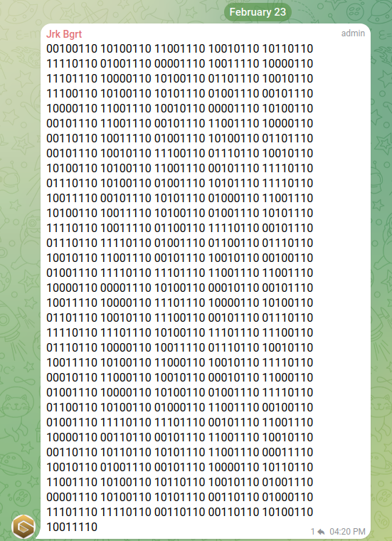


## 2023-08-03 Hint

"Are you really looking for just the btc...?"

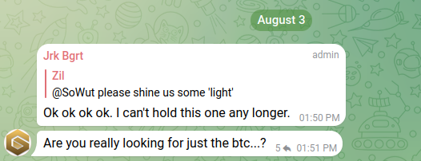

"the hardest part is done."

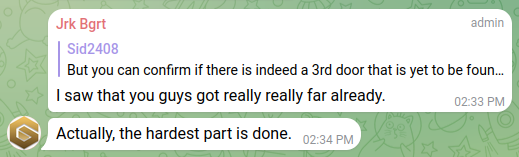

### Discussion
It can be noted that the "..." we see in puzzles shows up, and might be replaced with "key". The whole sentence can be reinterpreted as meaning "Look for the key"


## 2023-08-06 Hint

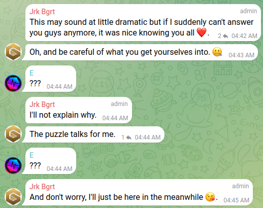

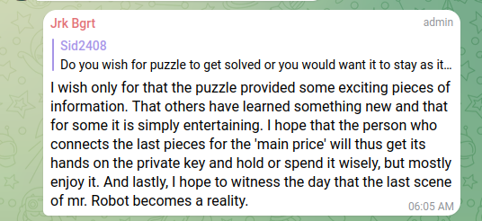

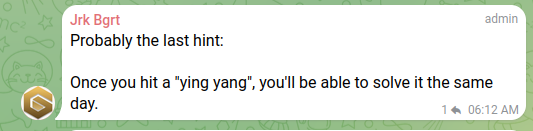

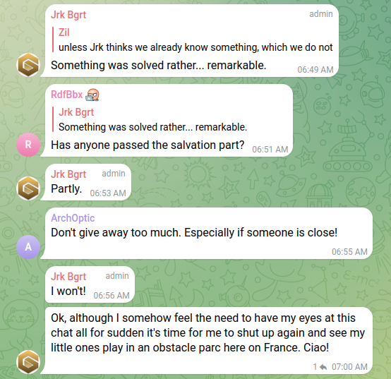
