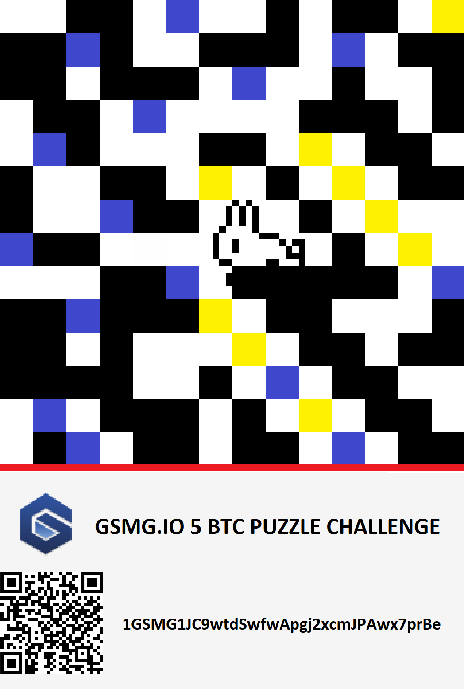
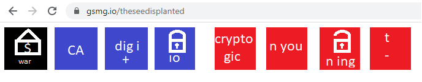
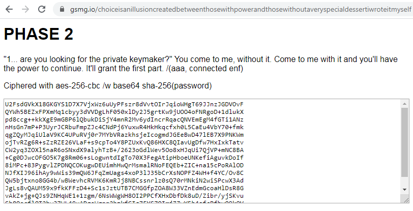
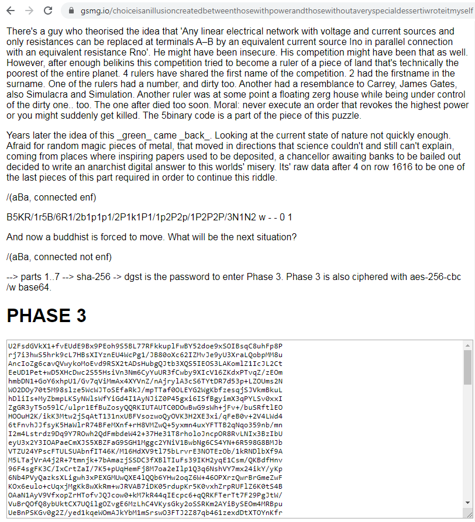
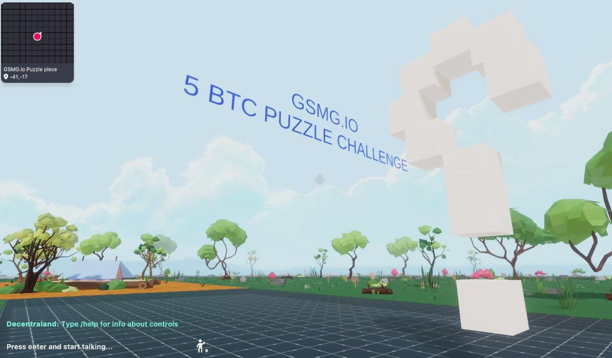

# GSMG.IO 5 BTC puzzle hints

This repository contains all publicly known hints for GSMG.IO 5 BTC puzzle challenge. Contributions are welcome!

If you find this useful, please donate BTC at [1JK27jtvE1wS4VG9k7Zpo8wBufMbYwy3r8](https://www.blockchain.com/btc/address/1JK27jtvE1wS4VG9k7Zpo8wBufMbYwy3r8)


- [Summary](#summary)
- [Tools](#tools)
- [Hints](#hints)
- [Additional hints](#additional-hints)



# Summary
- The puzzle was published at https://gsmg.io/puzzle
- The prize address with 5 BTC is [1GSMG1JC9wtdSwfwApgj2xcmJPAwx7prBe](https://www.blockchain.com/btc/address/1GSMG1JC9wtdSwfwApgj2xcmJPAwx7prBe)
- Discussions on Reddit: [gsmgio_5_btc_puzzle](https://www.reddit.com/r/bitcoinpuzzles/comments/dfwcqk/gsmgio_5_btc_puzzle/), [gsmgio_5_btc_puzzle_challenge](https://www.reddit.com/r/bitcoinpuzzles/comments/bf7siz/gsmgio_5_btc_puzzle_challenge/)

# Tools
- SHA256 online tool - https://xorbin.com/tools/sha256-hash-calculator
- To decypher AES encrypted text, use https://www.openssl.org/
```
Useful OpenSSL flags:
-d decrypts data
-a tells OpenSSL that the encrypted data is in base64
-in <filename> specifies the file to decrypt
-out <filename> specifies the file to put the decrypted data in
```

# Hints

## 1. https://gsmg.io/puzzle
Squares are bits, black/blue - '1' and yellow/white - '0'. It's a 14x14 binary matrix:

```
0 0 1 1 0 1 0 0 1 0 1 1 0 0
1 1 1 1 0 0 1 1 1 0 1 0 1 1
1 1 0 1 1 1 0 1 0 0 1 0 0 1
0 1 1 0 1 0 0 0 0 1 1 1 0 1
0 1 1 0 0 0 1 1 0 0 0 1 1 0
1 0 0 1 1 0 0 0 1 0 0 0 1 1
1 0 0 1 1 1 0 0 0 1 0 0 0 0
1 1 1 0 0 0 0 0 0 0 1 0 0 0
0 0 0 1 1 1 0 1 1 1 1 1 0 1
1 1 1 1 1 1 0 0 1 1 0 0 0 1
1 1 0 1 0 0 0 0 0 1 1 0 1 1
1 1 1 1 0 0 1 0 1 0 1 1 0 0
0 1 0 1 1 1 0 1 0 0 0 1 1 0
0 1 1 0 1 1 0 1 1 0 1 0 1 1
```

Start from upper left square and go counterclockwise in a spiral. Convert the bits to ASCII characters:

01100111 (103 g)
01110011 (115 s)
01101101 (109 m)
01100111 (103 g)
00101110 (46 .)
01101001 (105 i)
01101111 (111 o)
00101111 (47 /)
01110100 (116 t)
01101000 (104 h)
01100101 (101 e)
01110011 (115 s)
01100101 (101 e)
01100101 (101 e)
01100100 (100 d)
01101001 (105 i)
01110011 (115 s)
01110000 (112 p)
01101100 (108 l)
01100001 (97 a)
01101110 (110 n)
01110100 (116 t)
01100101 (101 e)
01100100 (100 d)

What you get is: gsmg.io/theseedisplanted

## 2. https://gsmg.io/theseedisplanted



The pictures refer to the song Phases (by 2 Best Enemies).
This webpage contains a hidden POST form which can be accessed in the browser debug mode (F12 in chrome).
You need to unhide it, enter the password theflowerblossomsthroughwhatseemstobeaconcretesurface and hit Submit button.
You'll be redirected to the next step.

## 3. https://gsmg.io/choiceisanillusioncreatedbetweenthosewithpowerandthosewithoutaveryspecialdessertiwroteitmyself



This is a reference to The Matrix Reloaded movie: 
> Merovingian: You see, there is only one constant one universal: **_causality_** - cause and effect.

> Morpheus: Everything begins with choice.

> Merovingian: No. Wrong. **_Choice is an illusion created between those with power and those without_**.

The password is causality.

SHA256(causality) = eb3efb5151e6255994711fe8f2264427ceeebf88109e1d7fad5b0a8b6d07e5bf

To decypher the text, use openssl. Copy the encrypted text into phase2.txt, then run:
```
openssl enc -aes-256-cbc -d -a -in phase2.txt -pass pass:eb3efb5151e6255994711fe8f2264427ceeebf88109e1d7fad5b0a8b6d07e5bf
```
Decryption result:
```
The ironic 2name of the keymakers trying to protect the current digital powers which are still in severe danger due to the keymaker's way of security by hiding, nearly unprotected, in plain sight. {eps3.4_[in one of the valleys of Phillip]runtime-error.r00., where daughters hit magic keypads} When this fails.. Crypto finally to the latin 3Moon? Tell me, 4How so mate?
# X 2 S H 4 Y 0 Q B 15 #
Q -> extend the name of a hackers' swordless fish, the I and W are below.
B -> ((BV80605001911AP)- (sqrt(-1)))^2
H -> (Answer to only this puzzle but nothing else) * -1
S -> cha' + (vagh * jav)
Ok kid, on the highway, let put it in the worst gear.
```

It is unclear how to use X 2 S H 4 Y 0 Q B 15, but it was observed that S is Klingon numbers 2+(5*6)=32 and BV80605001911AP is a model of Intel i5 processor, hence B=(5i-i)^2=(4i)^2=-16.
Using the other hints (2name, 3Moon, 4How so mate), you can decrypt the next phase. The password is a concatenation of 7 parts. The first part is causality.



1part
causality

2part
Safenet

3part
Luna

4part
HSM

5part
11110

6part is 0x736B6E616220726F662074756F6C69616220646E6F63657320666F206B6E697262206E6F20726F6C6C65636E61684320393030322F6E614A2F33302073656D695420656854

7part "B5KR/1r5B/2R5/2b1p1p1/2P1k1P1/1p2P2p/1P2P2P/3N1N2 b - - 0 1" 

Concatenate them all and perform SHA256.
SHA256(causalitySafenetLunaHSM111100x736B6E616220726F662074756F6C69616220646E6F63657320666F206B6E697262206E6F20726F6C6C65636E61684320393030322F6E614A2F33302073656D695420656854B5KR/1r5B/2R5/2b1p1p1/2P1k1P1/1p2P2p/1P2P2P/3N1N2 b - - 0 1) = 1a57c572caf3cf722e41f5f9cf99ffacff06728a43032dd44c481c77d2ec30d5

```
openssl enc -aes-256-cbc -d -a -in phase3.txt -pass pass:1a57c572caf3cf722e41f5f9cf99ffacff06728a43032dd44c481c77d2ec30d5
```

Decryption result:

```
What if the merovingian is wrong. What instead of causality something else could be ours? Therefor, if so, the ...... is ours. The thinker's 1name behind all of that would grant you access to the next step (of humanity). Definitely look into his works might you have time. /(aa,connected enf)

I just passed a cheshire cat and I'm getting fed up with this puzzle.. It's taking forever. But, How long is forever? I don't know, but just add giveit in front of the answer and you can fall in the keyhole. /(aa,connected enf)

3.The fundamental limit to the precision with which certain pairs of physical properties are know. /(aa,connected enf)

Phase 3.2 is ciphered with aes-256-cbc base64 and a sha256 pw, yet again.

U2FsdGVkX1/u/Exb78Flah0YM7yMVzRigu/5MKd5MG/d1Yncv3MIlTSMPFl6iZtT
Dx7JJRbZYZwm18L9XZ2k3+qm7gNxmg7zbg4Qz8rgUe/E3S54WuDMxxKcg7refbj2
U+upsLJ7wBmZk1KHxT0MzXv7teub7GuOqyCdChPd1dRScXa3OVk3oQWpFc6nPmBM
M1wBB2h41eaQc9j0p4spW+3PN0zbg5HGl8+44KvMHheNDWvw7dS18NTMKnXIx42Z
2RwAZvTLxI2Lsx0RiGIcxZzCSO3kdZS0PCyPlKSRBrdTLtSWHLvM+PgdTXAWKv+u
t+GKa8YrPYMeTv9v2nG6Twg/8OFRNmXI29RFOW5zEkH7ZzAZ13lIaiM6/f4DzKbk
Jwky9ngIOOdcsPSTox/xFv/jB6ZYM6ElqCs+gKSo1LwsvPexco18VvfgfO4vLmWB
Z1Pdgu/nUoQm71XmzCTjUjyiH9cZf+4iqjjAPl/q/pPx9TIPmejWDTQi/Tw3wtv2
UpG621OUWRIle9YBSjhIVIPXpbFiUpEV85AiiQ6VdN05+WcCByZ5wIQBFPDnRjeS
24CXPRKmVWfLmvXbR3DE/ICiBw8h9n3636PIScO1Nv1pUHCJvCSjxJOANl01XAEB
7wrOlmn5p8mSLZQ7J0xOlBPvf5dk6T+rYROMl5rKrd+i0QXT92y3Pel5cBDQlA2D
Eq2yqtqKxRGaFJkNS2u8cKI2NBskowo+aeZNg6fpLB9N12dEKAWGh18Xj5I2YUsv
l9zxebddjSbFCM9PJ8FJwEKRok6jl+Jm732y2Gq8OuAHGk0IFUFE/WE2C7GpLdHn
M9pN3I+r+OTYcMZ/VFKhMjqkjUWb5zquWj8HSYwsRrtPbnjaucqW4I5kyBRvvi42
YD6gu0xY6ClckNoKOYyH5llRQ7E9+rgOsxrAJF3JbHiZmLg7Z/YWZkwvCnwEdR9x
Y3PUyjEzT5K/D2qYYcMtgsUgYfRD9W9Z41bcMOJBKT3PNdxOAwEyFWpN7hGtRVd9
ACPyz2djZYE7Fi2LzVvlRh1ViSdkQifiwrXO9WjraNV0XixJgijGrzKYPK/vaXxo
8g7LboXi4/gpLN3GzOQf49g3ijfi2Mng5TL6qUwG4jjoVYa/dV2OfuCIZugCRWkg
SzmqZ/Q0mwtbQNcbVFG/0ds0CDh8W8OUc4v64V8HFSx4XCjDo2Hi5DUxBGTjnGKV
kmd802s7UxjbNO34Sza4xwJ24i23cq5CE2wQKhiFq8EqlbRqjzfvpHNXxdR6sVw7
lrJNj8J+U7Vhb16NRUrGpBjCU2w0iRFyrDTrctVXsAwZBGDsmo77jJEvlqztZj+m
MEs8lA807eo8A8lnTRTJzLMbHnqbJbNwfSfNjqJ52r7Vqh6dN6Mud0E9Iw7obKm8
IzcaTCghE6Lqd5IMYy9Z/NX5qSG4KhqM4ZCslCH9GIcRW0ZOIZOopv5Gouk53A3E
pDUkyC/WSukeoxbqkIfSdgi/In2Snp7SnvoF0WVjZcyrnsHcSeoRJEAeiSBQIUTL
cV2sHifQMFOCPzCMY96Vkcjav38qx8tFiRcc7cb4ZE28HoqnBPmStXIW4ib3Y8+F
5wKW8gmEQCb4gnwL/C9s5T44djGy+70g5c01GDpyROQJWPXAVoMaIFFkdba00Y0m
NQrl9gFonLcheonYKuMtSwEU18AMT0c7+CRCb2SK2gwhh2sitA9V8T5jyAGSXc0t
IZGVrKb0IIA3GfKbYfILdKgUk7C5H9DVsucAN8/vg/VjTNoGpMPv2AUfmtvjqFjI
lNBam1ODn26Cfj02bJL7r+B4aqid8sgGHH9dVxFQHhnUmeg0SNjQDEr3Ws90ZJ7b
cQ1Ierbq0Bxonau2YNZQ/3VfnQ9TlGJxmw9RNRoA60Vn9rBY1qbG9UPVAJe5VHoe
jddj9i3rP1NZ9LVeNX0zUxbVsGCt7TihDVGWRrMJopvlywzRUMyl7CTdRu6HVg3l
7pFSBb5qmq/H3s6Kgt9OOuYB4Ojy1NnR9GNR8iCnWe+eXnPMg5o0ede/zr570vr9
3/ioOoT3tCBDlBY8g6J/qiqvoixVk8JBVXhQrjA40QritQeu9jzHqN0F/FmLMKnK
VcVdvZOWPfw/DW/jaiaji3csKQxia2WignvDn83Iv15TridcIHELPUigfw8n4xzb
irgEY3VhlSXmsQk8jKpaENJHlhCZxYhUKAxOZgZP3VLXz3GOQhYyJnv7MUexuSVK
czbD+ab8uUg3W7nqoqKt02HvjKjFAYQaIZUgvX0c3EY773eFpUTO7C28okGNOUXC
HJfQvc1GviKUA5Ef6xad5AQzR+0UeTkuiex/NoPB/ouVkgNReUapnvdgh+kiDOsw
5P8D9zWcuyWYoDdtWeki5o2lic/hw+fx1F2FL36JYmj5IoXecMp1uq7BO8x7mZ5L
ROZZKorMkL4HlUQeglk6wdY4/msZJL9dOkoaCR4rIi9eEUQlH8oTpOjgy7qMB4qC
UkCEqNdyrsavw7egkb/S3gGWfBPL4E2TYrkJyLPNAfkNAq3ucuUHZnDW+Btv29ge
xoJz6DTfDkBE8npGXJzrJYeWcQJOis0Wre2pKaG9IyoIBbsHpOKJ3V1xqUIONWmS
VlCiVdeC08Bfe6N9qPr4I2Sh3qazGTCWS9ewTv+vDuZ3oY7esZ8eHNEHELxGUksf
mDpAMfjIudqB8bshlgtAw+Uy2ess6rtF7u1bRVKAaVCdl1/cul1hhB8TS8AabtgI
cNRT9V1Szs0lQ2PgdoNhiOKNusp0+TN6KgrWYrY0EEocEKRLuxrRQpMrG+LZ3eTw
7ZG0Tct/yGu/GAuzvHXEss79Vram40wuA+K6WG6FTStgJBpWwtRh7/LEuXpKannQ
pJR8i7Db0Su05ogJjUP8Uyd5RKPxoQV6tUWkZY5qBq47aL6M1xv/7gfkatASwdts
8VfG11ynby+xfhkZJFXUMTqvQOcwkx7gVED2wRWymuP/H0yCWogzD++rkE+TJUK9
hVjr2FbHN8zRtbkpYwxRln7sPe/dqHTvMoRo4r5IJsaXmaAQgEc7dBwNN7PeROzI
uwXA8V+Me77PupUbA1OHVxLHqt2FeUpMT+6UeteVtyyQInJ478Qml7Hfh4zMr0O4
BG3IYyFEN9ryiMoXYCogsjE9cNus9hlSrcA1NGyIl4q/bPlGCU6oaFUDCBcvzydZ
yc/PWKcXaA1ANvT/Q7rMi58xHyTS5B/3rjpQ8VGq+6AMRd4VEeXitewbB16L8CPN
```

1. Jacque Fresco quote: "The future is fluid. Each act, each decision, and each development creates new possibilities and eliminates others. The future is ours to direct."
2. Alice: How long is forever? White Rabbit: Sometimes, just one second.
3. Heisenberg uncertainty principle

SHA256(jacquefrescogiveitjustonesecondheisenbergsuncertaintyprinciple) = 250f37726d6862939f723edc4f993fde9d33c6004aab4f2203d9ee489d61ce4c

To decypher this Phase 3.2 text, use SHA256 again:
```
openssl enc -aes-256-cbc -d -a -in phase3.2.txt -pass pass:250f37726d6862939f723edc4f993fde9d33c6004aab4f2203d9ee489d61ce4c
```

The result of decryption:
```
I've been waiting for you. You have many questions, and although the process has altered your consciousness, you remain irrevocably human. Ergo, some of my answers you will understand, and some of them you will not. Concordantly, while your first question may be the most pertinent, you may or may not realize it is also irrelevant.

... am I here? Wake up, you... I've designed you a beautiful strategic position. One for one, four for one.

╬╚,╬°%_┴°°╟%═╧/╟╚:_Ў°├╤°═╠?╟/°╚═,::╚┼╤,├╧°═`/╚?╧`>%┴┬╚╔╧├├╬┼///╠Ў├%╩╠╬?,%╤┼??╠┴╤┴╠Ў`╧╧═,══[└%├╧°╧┴,?┼╦>┼┬╬╚:_>╚┴═%╟°═[╟_╩/┬╤╤┴Ў°╚╬[/╔┬╦°╔/═╟°_└Ў╔╟/╔╟═`└└╤╧┼╠╬╠┼°?├/╔╤:╦┴>╚`┴╦╔_┼[╟═/:_`╟_>╩┬:╤?`╟═[╬╔:[├_╧╠?╚?_?┬%├┴┬%[>┼°°╦┴%╦>%╧/┴╟[>╧╠:>/`>/[┴/:╟├:┴═>°┴┴╧Ў╬╟Ў`╦╔Ў°°?╦/%/┬:═/°%°°°╚┴/├╬╬>:°╩`╟╦>,Ў═╠╦_,═┬>>╤_?°═,?Ў┴>╦>%├╠├/┬┼┴═Ў_`╔┬╔╧╚>_:╤╚┬╚╔╧═,═╧├>╠_├°┴°╠═╤╧═╠╔╔╬┼╧┼°:°°╚>┼═`/%?/╬╦>,°°═╟?╟,[/:╩┼╟_╩°┬╟╤[┴┼╦Ў└>╚╚╚┴°╔└_:╩,└┬╦╚╤/┬>/╦Ў_`╚┼╟╔╟╤_[/└┼Ў╬%╟═╬╔///┬/┬`╚╠╔╟┴╚╬>°╦,>┬╤>°╠╠╧:╩,├[:Ў_╟°╟┴:Ў_`└,╔╚╔╩╤╠%`╟└?%╟═?[°?┴[╧/,/├?_%═?└/?╠_╟╠,╤┴╟┴,┼,╤╚═┴%_`>┬°═╟?╬?┬%°╤`Ў/,┬└═╠┬═%°├>>╚[├_°╔└╦├└,[/╬/:╟/,╤┴°┴%`╬/┬┬,?╤╚`[├╬═╦╟,┬[Ў╧:═/└╤╬├_┼Ў└_┬/╧:╟_>┴,┴%╟═?[°`,═╟_>╠╤>╤╩┴┼Ў╔:%┴>┬`┴╠┴_>°═[/%┴┴╤/Ў╬╩Ў_`╟└_?└%┴?°╔,╔>>:╔┬??╚>╔_[`┬_└╤/Ў╠_╩└__>╔`┬┼╚%%╔,[╤:═╤╟_Ў╔°╬╤┴╟╠╧/╚%╤°╤╚═└?╚╦├╔┼:_/,_╟>°╔:╤>`╠╚:?┼`┼╤┼╬╚_╧┬╚┼╟%°╠╚╚°┼╤├?╟╦┼┴_°,°╤`/╚═└?_/`╔╚:╧╚═╚%`_╚╧°°═┬_╚╧╧═╟_>╧Ў°╟└╟,╩%├%_:╤>═╦╟°╟╩═╤╚═>╤╤┴└╬├└╤╩┴╬└°°%_╤┬╠╩╚┴╟%╔╧`%╧╚:_/╔┴┴/╧╟`╧┬/:╦╤╦_╩>╚┴╧/├╠┼╬└┬_Ў°:°_└╤/┼//╤╟╩Ў╦_╩>╚┼╧╔,[╔°,[╤╧╔Ў╬╩╧[?╚Ў_╩:/:╟╚`/┴?╚?╚═╟╩?╧`>├_°╔└[┴┴┼[┼╚╤╚_[>°└╔>:,╬>°°╔╦Ў╩>┼Ў┴╧/`└Ў├%╧:═╚`┴%╦_┬`╠╧╔:_═╧╟Ў╬╠?╦┴%/°///,_╔>,Ў>╚┴Ў,°:╧╚?`╚/╩:╔╧,%╧╔[?╧:═/,┴╤╔╦┼═>═┬:[═/?`┴┼%╚,╧╟╧├>╤┴°╤╔┴┼└,`╔╠╔╔?╔═╧╤>┼┴[Ў┴_/:°╔%╔╧┼`,┴/Ў?═__┴//╬╤┬Ў%┴└╧├═┬╦[Ў°╚╦├┴╔╠═╠┴╟╧╔`└╩┴>/>╩┴%╦├═%├╚°_╔_[?╔┴╚╬,%%┬_└┴,╟:╩╠╤╔╦╠`╬╔Ў└┼:_/>°╔╟╟╦>╧┼╦╔,╚╧?└╩╬:>__┼?_?└╤Ў°┬?°╔╧°╚?_╤>>╤╟├°═%╦°═[┼┬_?╠┴╤┴/═╬└╤/[┼Ў╤╔/═┼╤`/,╟`╦├?╦╤Ў_/╦╩:,├?╧┼╧╠═┬/═┴°╤Ў╬╩Ў_`╟╦_╤╧°`┴°/_╔:`%╧//┴╧/Ў┴%`┬┴/╧?┬╬╔[╬╧://Ў═,╚╬═,═└╠:╚┬╟├┼/[└/├╬╦_╤╧,┬╟%├╤┴└°═╟,[:╧%┴>/,┴╚,╟,%_┬%╚╩`╬/,┴╚═╟,╟,╟°°_`╬╬└?┼°╧╟╚╧╔╤[``_╔┼?╬╠>?└,└///┬╧┬:/┼└/╟>╔>├╦/?_:/┴┴/╧┴%,╦%╟╔%╧╤┼╤Ў

15165943121972409169171213758951813141543131412428154191312181219433121171617137149110916631213131281491109166131412199114371612126021664313711154112

Raising the stakes without extra chances of winning. A fubcd-king & oracle-queen, thingky mvps, on a sad board but as wide as the first one seen.

U2FsdGVkX1+0Wl49gnWTyiimluu7V3+vl7st0gUt9sWDzNLxDmlPMsDSiuW2a46z
gKlIi8aaqY5gpJPPEzW1n9n3/26qs4zstWtPKF8Zs/BTNN4IiEh4qu18mdC0NAv4
```


- phase 3.2.1
The first blob (╬╚,╬°%_....) converted to letters:

vtkvplmepphluwahtzmjpfipuxohaptukzztgikfwpuyatowynlebtqwffvgaaaxjflrxvokligooxeiexjywwukuucdlfwpwekogsngbvtzmnteulhpuchmrabiiejptvcaqbspqauhpmdjqhaqhuyddiwgxvxgpofaqizsentyesqmgchuazmyhmnrbzioyhucvqzcfmwxotomoblfeblcngppselsnlwaehcnwxznaynaceazhfzeunpeewjvhjysqjpposalabzuaplpppteafvvnzpryhsnkjuxsmkubnnimopukojensnlfxfabgeujmyqbqwtnmzitbtqwukuwfnxmfpepxuiwuxqqvgwgpzpptnguyaloavsnkppuhohkcazrghmrpbhicegsjdntttepqdmzrkdbstiabnasjmytghqhimcadgjvlhuvqaaababytxqhetvnpsknbinpxxwzrkfczjmhphezjmydkqtqrixlyhdolhuocpoecwakafomluodaoxmhxkiehekgkituelmynbpuhovoblpiyjakbduxbulpfnntcfmpqdsfdkcavazhakiepelyvabbkoitycfvushkbcjwzuadivfmgjdmbawzhmnekelhuocpykuhmnxiniregjqzlenbyexemnpucaleeiajvrjmyhdmodleopqkqnnzqbootnqmcybmdiajxmrdmmnqybgtllqkcizuihmjqpviehxwatlipitudotsfqgzmakmhnpqzinyxtzogygigvtmwbtghlpxttpgifohsgempkpiyatudomayqtzwtutlymtwppubmtwwuhmnwjphdhkrlflmzinushphruituniiedvfdirevdpplmibxrtehlqwylwtzmaqeeawhywbazsismrntewafxgvdbmjpzpmdiagaaihrjsmrntgwqkcqpkciwqjvrwcotjmrzazhtyaeototuhrowynfmpqdceegcgtitmcnpdqnzkvnppqsjrngjewaydjflwzutyelsmbyxwqzmuwhjvxoselapaaakmqnkjntejkpzwtoytarzqwklwqcowzuakeiqsgunubzcuaoyegltkwhwfniepiqegdkyqxqqoquwingecjemazpqlqwgykeajoummeaavibjledwfubscjptsfeqxuxehwqydrenanrelsfulftpmqmcoqetvkllbmdekhzrxiqsxyvqjdgzmanpqhhsnwgsqktwodrvznmmgomodijpbopqwptominnihfpulspucgbmoxeieauvdiacgjiqaugiyakhysfosijmasrzkfowgwxubauepijvrjmyhsmiwpyepamqzylwaaewajelybeawobvqcvwzaajuktvukudxztbhfgacdafvsmiwkbhlfiedpuhkczwlenaketkhklmbltryvaketuhkhkhppmyvvdogpwhtwqicyymqgovxnodkdaaabwbzagdahnqnfsaomzaeeawelkslhqlwigij


Go to  https://ciphertools.co.uk/decode.php , paste this text to input and choose Beaufort to crack it (the password is THEMATRIXHASYOU by the way). The result of decryption:

```
YOUR LIFE IS THE SUM OF A REMAINDER OF AN UNBALANCED EQUATION INHERENT TO THE PROGRAMMING OF THIS PUZZLE 
YOU ARE THE EVENTUALITY OF AN ANOMALY WHICH DESPITE MY SINCEREST EFFORTS I HAVE BEEN UNABLE TO ELIMINATE 
FROM WHAT IS OTHERWISE A HARMONY OF MATHEMATICAL PRECISION WHILE IT REMAINS A BURDEN TO SEDULOUSLY AVOID IT 
IT IS NOT UNEXPECTED AND THUS NOT BEYOND A MEASURE OF CONTROL WHICH HAS LED YOU INEXORABLY HERE YOU 
YOU HAVEN'T ANSWERED MY QUESTION ME QUITE RIGHT INTERESTING THAT WAS QUICKER THAN THE OTHERS PLEASE IF YOU 
FIND A WAY TO COMPLETE THE LAST PART OF THE PUZZLE TAKE THE PRIVATE KEY YOUVE EARNED IT BUT PLEASE TAKE 
THIS TO HEART THAT WHAT A WISEMAN ABOVE HINTED AT IS WORTH HUNDRED FOURTY OF THE INVESTMENT THAT'S 
WHAT US GUYS AT GSMG ARE TRYING TO ACCOMPLISH IN THE END PLEASE JUST HELP US BUILD IT INSTEAD OF JUST 
WAISTING YOUR LIFETIME BY HUNTING FOR WORTHLESS PRICES AND THROPHIES LIKE THIS I'M SORRY TO 
TELL YOU THAT YOUVE COME THIS FAR BUT YOU'LL NEVER FINISH THE LAST TASK I EXPECT YOU TO SAY BULLSHIT 
WELL DENIAL IS THE MOST PREDICTABLE OF ALL HUMAN RESPONSES BUT REST ASSURED THIS WILL NOT BE THE LAST TIME 
I HAVE DESTROYED A RESTLESS SOUL AND I HAVE BECOME EXCEEDINGLY EFFICIENT AT IT THE FUNCTION OF THE YOU IS 
NOW TO RETURN TO THE SOURCE CODES ALLOWING A TEMPORARY DISSEMINATION OF THE CODE YOU HOPEFULLY CARRY 
REINSERTING THE PRIME BASICS AFTER WHICH YOU WILL BE REQUIRED TO SELECT FROM OVER TWENTY-THREE CIPHERS 
SIXTEEN ENCRYPTIONS AND OR SEVEN INTERTWINED PASSWORDS TO FIND THE ACTUAL PRIVATE KEYNOTE THAT ALSO 
BRUTE FORCING MIGHT BE REQUIRED FAILURE TO COMPLY WITH THIS PROCESS WILL RESULT IN A CATACLYSMIC 
SYSTEM CRASH KILLING YOUR WILLPOWER WHICH COUPLED WITH THE EXTERMINATION OF YOUR WILL TO LIVE AND WILL 
ULTIMATELY RESULT IN THE EXTINCTION OF THE ENTIRENESS OF YOURSELF SELF GOOD LUCK NEVERTHELESS I REALLY
HOPE YOURE THE ONE CIAO BELLA O 
```

- phase 3.2.2
input: 15165943121972409169171213758951813141543131412428154191312181219433121171617137149110916631213131281491109166131412199114371612126021664313711154112

1) https://www.dcode.fr/vic-cipher 

alphabet: ABCDEFGHIJKLMNOPQRSTUVWXYZ./
digit 1: 1
digit 2: 4

output: NODHVKRFBSHOHPKLFDGHDQLMNVLMKUGNTHLKQKRVCKJFOPLFMHJAHOECKLLKGMHJAHOELMKRHJVFOKKEABOEVLFJNTK

2) https://guballa.de/substitution-solver

output: IN CASE YOU MANAGE TO CRACK THIS THE PRIVATE KEYS BELONG TO HALF AND BETTER HALF AND THEY ALSO NEED FUNDS TO LIVE

# Additional hints
- There's a hint from the creator of the puzzle on Decentraland:

If you go to Decentraland and find these coordinates, you'll get an audio file.
Split stereo track, invert one of them, mix them back, mix stereo down to mono, create a spectrogram. The answer is:
HASHTHETEXT

- Another hint from the creator:
```
Roses are White but often Red.
Yellow has a number and so does Blue.
Go back to the first puzzle piece without further ado.

It might have shown you only one door, beware that the rabbits nest may contain a whole lot more.

Hush hush.
```
